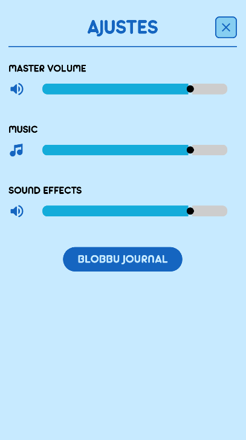
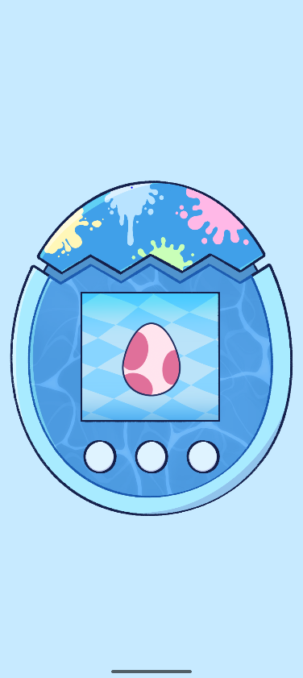
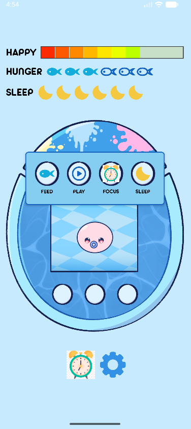
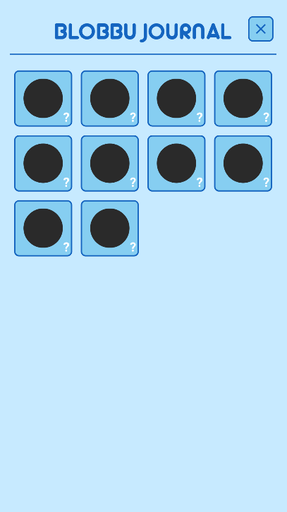

# 🐾 Blobbugotchi

Blobbugotchi es una aplicación Android inspirada en los Tamagotchi clásicos. Cuida a tu Blobbu alimentándolo, jugando con él y dejándolo descansar. Usa el temporizador Pomodoro integrado para hacerte compañía mientras trabajas o estudias, y descubre todas las evoluciones posibles de tu mascota virtual.

Proyecto Intermodular de Grado Superior en Desarrollo de Aplicaciones Multiplataforma (DAM).

---

## 🛠️ Tecnologías utilizadas

- **Lenguaje:** Java
- **Entorno de desarrollo:** Android Studio
- **UI:** XML layouts + Custom Views
- **Base de datos:** SQLite (local)
- **Mínimo SDK:** Android 8.0 (API 26)
- **Target SDK:** Android 14 (API 36)

---

## ✅ Requisitos previos

- [Android Studio](https://developer.android.com/studio) (versión narwhal o superior)
- JDK 11 o superior
- Un dispositivo Android o emulador con API 26+

---

## ⚙️ Instalación

1. Clona el repositorio:
```bash
   git clone https://github.com/mariajose-portfolio/proyecto-dam-blobbugotchi.git
```

2. Abre el proyecto en Android Studio:
   - `File → Open → selecciona la carpeta del proyecto`

3. Sincroniza las dependencias de Gradle:
   - Android Studio lo hará automáticamente, o pulsa `Sync Now` si aparece el aviso

4. Conecta un dispositivo Android o lanza un emulador

---

## ▶️ Ejecución

1. Selecciona tu dispositivo o emulador en la barra superior de Android Studio
2. Pulsa el botón **Run** (▶️) o usa el atajo `Shift + F10`
3. La app se instalará y abrirá automáticamente en el dispositivo

---

## ✨ Funcionalidades implementadas

- **Fase de huevo:** el Blobbu nace tras un período de incubación con animación de eclosión
- **Sistema de estadísticas:** barras de felicidad, hambre y sueño con iconos personalizados
- **Acciones del jugador:** alimentar, jugar y dormir al Blobbu desde un menú emergente
- **Animaciones:** el Blobbu muestra animaciones distintas según su estado (feliz, triste, hambriento, durmiendo, comiendo)
- **Degradado de vida:** las stats bajan automáticamente con el tiempo
- **Pomodoro integrado:** temporizador de trabajo/descanso que interactúa con el Blobbu
- **Galería de Blobbus:** pantalla con todas las evoluciones desbloqueables
- **Pantalla de ajustes:** control de volumen general, música y efectos de sonido
- **Navegación:** menú inferior con acceso a todas las secciones
- **Orientación bloqueada:** la app siempre se muestra en vertical
- **Persistencia de datos:** guardar y cargar el progreso del Blobbu con SQLite
- Sistema de desbloqueo de la galería ligado a las evoluciones conseguidas
- Integración completa del Pomodoro con las estadísticas del Blobbu

---

## 📸 Capturas

### Configuración


### Pantalla principal


### Pantall principal con menú a la vista


### Galería de Blobbus


---

## 🚧 Funcionalidades pendientes

- Sistema de evolución: el Blobbu cambia de forma según cómo lo hayas cuidado
- Minijuego para subir la felicidad

---

## 👤 Autor

**María José Espina**  
Grado Superior en Desarrollo de Aplicaciones Multiplataforma (DAM)